<div align="center">


# Symbols

A file icon for VS Code


</div>

## Contributing

If you'd like to contribute to this extension, please take a look at the issues or create a new one. If you'd like to create a new icon, please reference the [Symbols - File Icon Figma file](https://www.figma.com/file/HYLMyRbIdSbIJQlqnd9pSN/Symbols---File-Icons?node-id=20521%3A84115&t=PyBzZOlVG5TXyEdx-1), you can make a copy or reference the styles used (tailwind). Please try to limit your colors to the ones used in existing icons before choosing a different color style.

When submitting a PR, please ensure you've tested the extension locally and ensure that your new icons appear correctly in the file tree view with your new file extension. Include a screenshot of your proposed icon in your PR.

## Configuration

You can configure which folders and files icons are displayed by using the following settings:

### Folders

```json
"symbols.folders.associations": {
    "entities": "folder-assets",
    "infra": "folder-app",
    "schemas": "folder-purple",
}
```

### Files

You can use `*` to match all files with a specific file extension:

```json
"symbols.files.associations": {
    "app.module.ts": "ts",
    "*.service.ts": "nest"
},
```

### Icon Previews

You can choose which icons to use from our Library:

|Name|Preview|
|--|--|
|folder-app||
|folder-assets|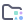|
|folder-blue-code||
|folder-blue-outline||
|folder-blue||
|folder-config||
|folder-gray-code||
|folder-gray-outline||
|folder-gray||
|folder-green-code||
|folder-green-outline||
|folder-green||
|folder-orange-code|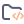|
|folder-orange-outline||
|folder-orange||
|folder-purple-code||
|folder-purple-outline||
|folder-purple||
|folder-red-code||
|folder-red-outline||
|folder-red||
|folder-sky-code||
|folder-sky-outline||
|folder-sky||
|folder-yellow-code||
|folder-yellow-outline||
|folder-yellow||
|folder||

|Name|Preview|
|--|--|
|angular||
|astro||
|audio||
|babel||
|brackets-blue|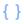|
|brackets-gray|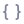|
|brackets-green|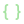|
|brackets-orange||
|brackets-purple|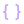|
|brackets-red|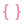|
|brackets-sky|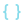|
|brackets-yellow|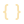|
|c||
|capacitor||
|clojure||
|code-blue||
|code-gray||
|code-green||
|code-orange||
|code-purple||
|code-red||
|code-sky||
|code-yellow||
|coffeescript||
|coldfusion||
|cplus||
|csharp||
|csv||
|cypress||
|dart||
|database||
|deno||
|docker||
|document||
|drawio||
|dts||
|editorconfig||
|elixir||
|erlang||
|eslint||
|exe||
|firebase||
|font||
|fsharp||
|gear||
|git||
|github||
|go-mod||
|go||
|gradle||
|graphql||
|gulp||
|h||
|haml||
|http||
|hugo||
|ignore||
|image||
|ionic||
|java||
|jenkins||
|jest||
|js-test||
|js||
|julia-markdown||
|julia||
|kotlin||
|laravel||
|license||
|liquid||
|lua||
|markdown||
|mdx||
|nest||
|netlify||
|next||
|nix||
|node||
|nodemon||
|notebook||
|npm||
|nunjucks||
|patch||
|perl||
|php||
|pnpm||
|postcss||
|prettier||
|prisma||
|proto||
|pug||
|pulumi||
|puzzle||
|python||
|r||
|react-test|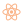|
|react-ts||
|react||
|rescript-interface||
|rescript||
|robot||
|ruby||
|rust||
|sass||
|sbt||
|scala||
|shell||
|storybook||
|stylus||
|supabase||
|svelte||
|svg|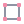|
|swift||
|tailwind||
|terraform||
|tex||
|text||
|ts-test||
|ts||
|tsconfig||
|v||
|vanilla-extract||
|vercel||
|video||
|visual-studio||
|vite||
|vue||
|webpack||
|xml||
|yaml||
|yarn||
|zig||