<div align="center">

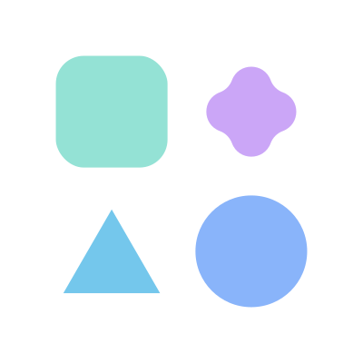

# Catppuccin Noctis Icons

A ~~blatant ripoff~~ fork of [Symbols Icons](https://github.com/miguelsolorio/vscode-symbols) using [Catppuccin](https://github.com/catppuccin/catppuccin) color palette.

Designed to be paired with [Catppuccin Noctis Theme](https://marketplace.visualstudio.com/items?itemName=AlexDauenhauer.catppuccin-noctis)

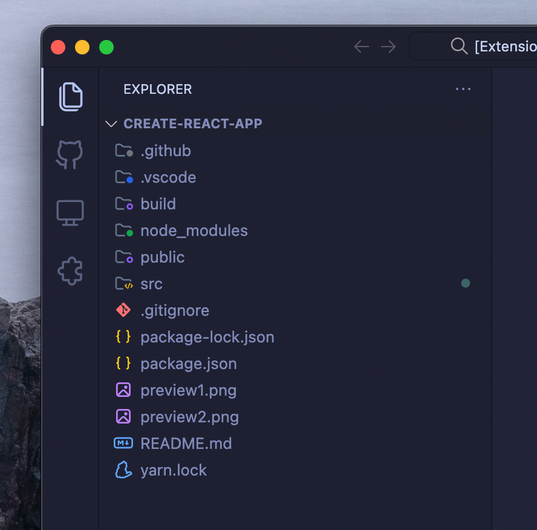

</div>

## Configuration

You can configure which folders and files icons are displayed by using the following settings:

### Folders

```json
"catppuccin-noctis-icons.folders.associations": {
    "{folder name}": "{icon name}"
}
```

And here is an example using this setting:

```json
"catppuccin-noctis-icons.folders.associations": {
    "entities": "folder-assets",
    "infra": "folder-app",
    "schemas": "folder-purple"
}
```

### Files

```json
"catppuccin-noctis-icons.files.associations": {
    "{file name}": "{icon name}"
}
```

And here is an example:

```json
"catppuccin-noctis-icons.files.associations": {
    "app.module.ts": "nest",
    "*.service.ts": "nest"
}
```

_Note: For file names, you can use `*` to match all files with a specific file extension._

### Icon Previews

<details>
<summary>Preview</summary>

|Name|Preview|
|--|--|
|folder-android||
|folder-actions||
|folder-angular||
|folder-app||
|folder-assets||
|folder-auth||
|folder-blue-code||
|folder-blue-outline||
|folder-blue||
|folder-config||
|folder-context||
|folder-core||
|folder-database||
|folder-drizzle||
|folder-effects|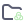|
|folder-facade||
|folder-firebase||
|folder-github||
|folder-gray-code||
|folder-gray-outline||
|folder-gray||
|folder-green-code||
|folder-green-outline||
|folder-green||
|folder-helpers||
|folder-images||
|folder-intefaces||
|folder-ios||
|folder-layout||
|folder-mail||
|folder-middleware||
|folder-models||
|folder-modules||
|folder-orange-code||
|folder-orange-outline||
|folder-orange||
|folder-prisma||
|folder-purple-code||
|folder-purple-outline||
|folder-purple||
|folder-red-code|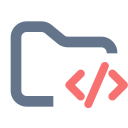|
|folder-red-outline||
|folder-red||
|folder-reducer||
|folder-router||
|folder-selector||
|folder-shared||
|folder-sky-code||
|folder-sky-outline||
|folder-sky||
|folder-supabase||
|folder-target||
|folder-tina||
|folder-utils||
|folder-vercel||
|folder-yellow-code||
|folder-yellow-outline||
|folder-yellow||
|folder||
|angular-component||
|angular-service||
|angular||
|astro||
|audio||
|babel||
|biome||
|brackets-blue||
|brackets-gray||
|brackets-green|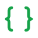|
|brackets-orange|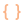|
|brackets-purple|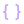|
|brackets-red|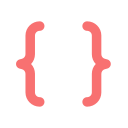|
|brackets-sky||
|brackets-yellow|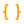|
|bun||
|c||
|capacitor||
|clojure||
|cloudflare-workers||
|cmake|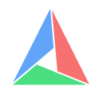|
|code-blue||
|code-gray||
|code-green||
|code-orange||
|code-purple||
|code-red||
|code-sky||
|code-yellow||
|coffeescript||
|coldfusion||
|contentlayer||
|cplus|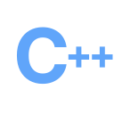|
|crystal||
|csharp||
|csv||
|cucumber||
|cypress||
|dart||
|database||
|deno||
|docker||
|document||
|drawio||
|drizzle||
|dts||
|dune||
|earthfile||
|editorconfig||
|elixir||
|erlang||
|eslint||
|exe||
|expressive-code||
|firebase||
|font||
|fsharp||
|gatsby||
|gear||
|gif||
|git||
|github||
|gleam||
|go-mod||
|go||
|gradle||
|graphql||
|gulp||
|h||
|haml||
|haskell||
|http||
|hugo||
|i18n||
|ignore||
|image||
|ionic||
|java||
|jenkins||
|jest||
|js-test||
|js||
|julia-markdown||
|julia||
|keystatic||
|knip||
|kotlin||
|laravel||
|license||
|liquid||
|lock||
|lua||
|lunaria||
|markdoc||
|markdown||
|mdx||
|minecraft||
|nest||
|nest-controller||
|nest-service||
|netlify|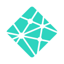|
|next||
|nix||
|node||
|nodemon||
|notebook||
|npm||
|nunjucks||
|nuxt||
|ocaml||
|panda||
|patch||
|pdf||
|perl|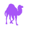|
|php||
|pkl||
|pnpm||
|postcss||
|prettier||
|prisma||
|proto||
|pug||
|pulumi|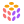|
|puzzle||
|python||
|r||
|razor||
|react-test||
|react-ts||
|react||
|redux-actions||
|redux-effects||
|redux-facade||
|redux-reducer||
|redux-selector||
|rescript-interface||
|rescript||
|robot||
|rome||
|ruby||
|rust||
|sanity||
|sass|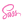|
|sbt||
|scala||
|severless||
|shell||
|solidity||
|storybook||
|stylelint||
|stylus||
|supabase||
|svelte||
|svelte-ts||
|svg|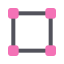|
|svx||
|swc||
|swift||
|tailwind||
|target||
|terraform||
|tex||
|text||
|ts-test||
|ts||
|tsconfig||
|turborepo||
|twig||
|unocss||
|v||
|vanilla-extract||
|vercel||
|video||
|visual-studio||
|vite||
|vitest||
|vue||
|webpack||
|xml||
|yaml||
|yarn||
|zig||
|zip||

</details>