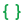
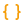
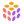
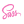
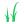

### Icon Previews

You can choose which icons to use from the [Library](https://www.figma.com/file/HYLMyRbIdSbIJQlqnd9pSN/Symbols---File-Icons?node-id=20521%3A84115&t=PyBzZOlVG5TXyEdx-1):

|Name|Preview|
|--|--|
|folder-android||
|folder-actions||
|folder-angular||
|folder-app||
|folder-assets||
|folder-auth||
|folder-blue-code||
|folder-blue-outline||
|folder-blue||
|folder-config||
|folder-context||
|folder-core||
|folder-database||
|folder-drizzle||
|folder-effects||
|folder-facade||
|folder-firebase||
|folder-github||
|folder-gray-code||
|folder-gray-outline||
|folder-gray||
|folder-green-code||
|folder-green-outline||
|folder-green||
|folder-helpers||
|folder-images||
|folder-interfaces||
|folder-interceptors||
|folder-ios||
|folder-layout||
|folder-mail||
|folder-middleware||
|folder-models||
|folder-modules||
|folder-orange-code||
|folder-orange-outline||
|folder-orange||
|folder-prisma||
|folder-pipes||
|folder-purple-code||
|folder-purple-outline||
|folder-purple||
|folder-providers||
|folder-red-code||
|folder-red-outline||
|folder-red||
|folder-reducer||
|folder-router||
|folder-selector||
|folder-services||
|folder-shared||
|folder-sky-code||
|folder-sky-outline||
|folder-sky||
|folder-supabase||
|folder-target||
|folder-tina||
|folder-utils||
|folder-vercel||
|folder-yellow-code||
|folder-yellow-outline||
|folder-yellow||
|folder||
|angular-component||
|angular-service||
|angular||
|astro||
|audio||
|babel||
|biome||
|brackets-blue||
|brackets-gray||
|brackets-green||
|brackets-orange||
|brackets-purple||
|brackets-red||
|brackets-sky||
|brackets-yellow||
|bun||
|c||
|capacitor||
|clojure||
|cloudflare-workers||
|cmake||
|code-blue||
|code-gray||
|code-green||
|code-orange||
|code-purple||
|code-red||
|code-sky||
|code-yellow||
|coffeescript||
|coldfusion||
|contentlayer||
|cplus||
|crystal||
|csharp||
|csv||
|cucumber||
|cypress||
|dart||
|database||
|deno||
|docker||
|document||
|drawio||
|drizzle||
|dts||
|dune||
|earthfile||
|editorconfig||
|elixir||
|erlang||
|eslint||
|exe||
|expressive-code||
|firebase||
|font||
|fsharp||
|func|[func](files/func.png)|
|fresh||
|gatsby||
|gear||
|gif||
|git||
|github||
|gleam||
|go-mod||
|go||
|gradle||
|graphql||
|gulp||
|h||
|haml||
|haskell||
|http||
|hugo||
|i18n||
|ignore||
|image||
|ionic||
|java||
|jenkins||
|jest||
|js-test||
|js||
|julia-markdown||
|julia||
|keystatic||
|knip||
|kotlin||
|laravel||
|license||
|liquid||
|lock||
|lua||
|lunaria||
|markdoc||
|markdown||
|mdx||
|minecraft||
|nest||
|nest-controller||
|nest-service||
|netlify||
|next||
|nix||
|node||
|nodemon||
|notebook||
|npm||
|nunjucks||
|nuxt||
|ocaml||
|panda||
|patch||
|pdf||
|perl||
|php||
|pkl||
|pnpm||
|postcss||
|prettier||
|prisma||
|proto||
|pug||
|pulumi||
|puzzle||
|python||
|r||
|razor||
|react-test||
|react-ts||
|react||
|redux-actions||
|redux-effects||
|redux-facade||
|redux-reducer||
|redux-selector||
|rescript-interface||
|rescript||
|robot||
|rome||
|ruby||
|rust||
|sanity||
|sass||
|sbt||
|scala||
|severless||
|shell||
|solidity||
|storybook||
|stylelint||
|stylus||
|supabase||
|svelte||
|svelte-ts||
|svg||
|svx||
|swc||
|swift||
|tailwind||
|target||
|terraform||
|tex||
|text||
|ts-types||
|ts-test||
|ts||
|tsconfig||
|turborepo||
|twig||
|unocss||
|v||
|vanilla-extract||
|vercel||
|video||
|visual-studio||
|vite||
|vitest||
|vue||
|webpack||
|xml||
|yaml||
|yarn||
|zig||
|zip||
